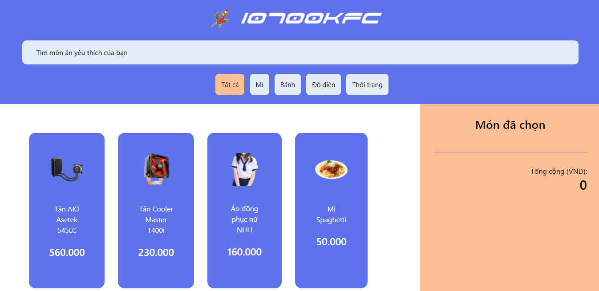
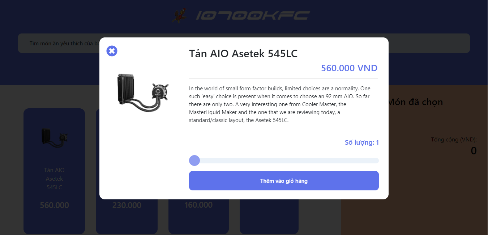
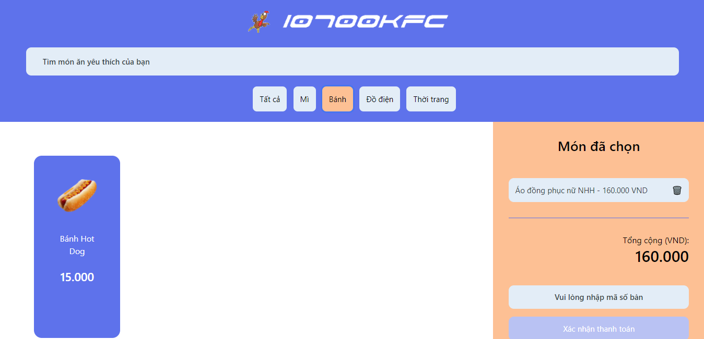
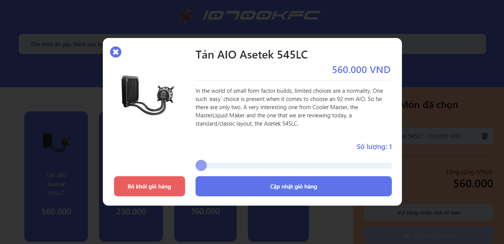
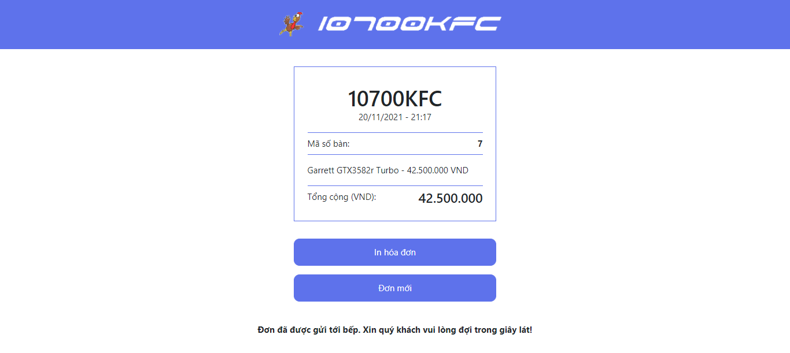
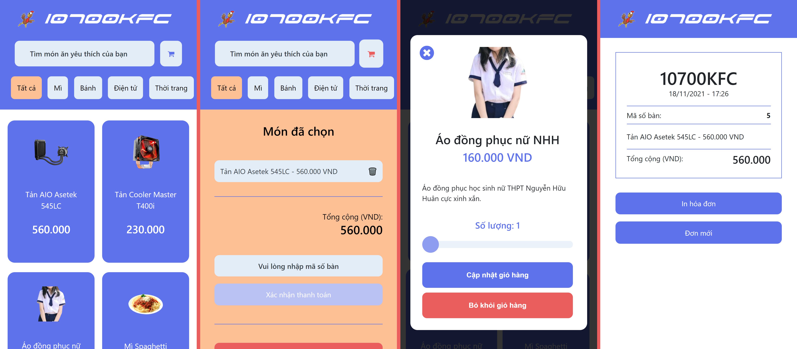
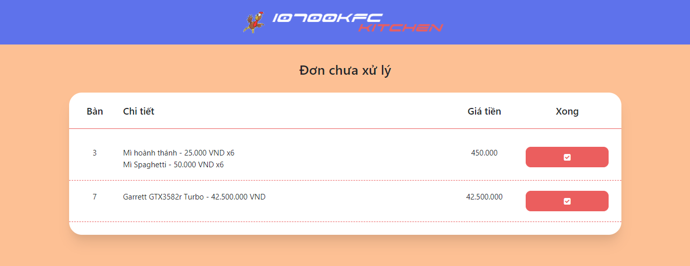
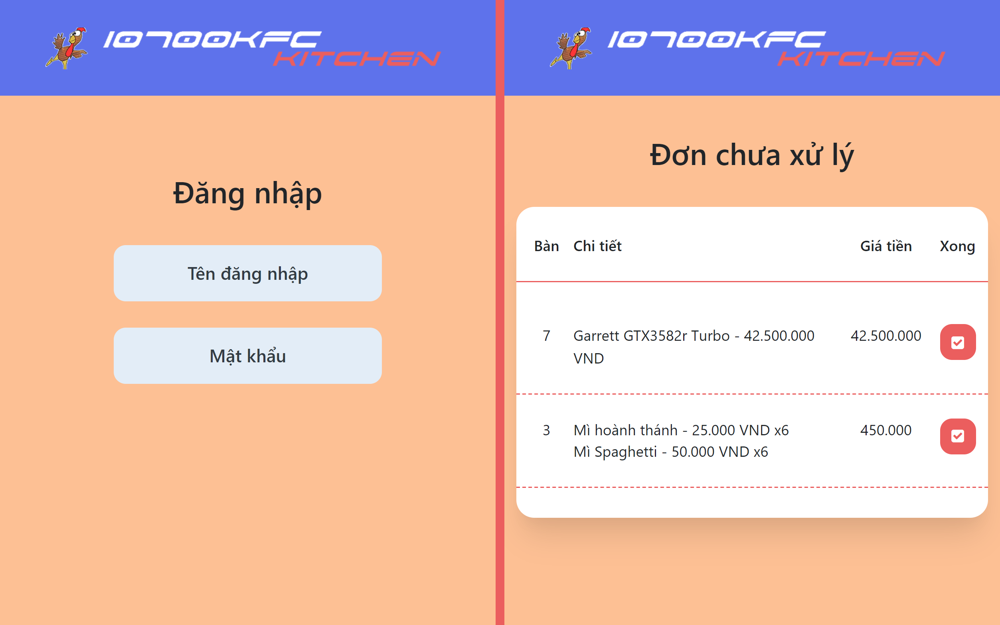

# 10700KFC WITH BACKEND

*(This is a clone of the original project with backend server add-on)*
*Visit the original project [here](https://github.com/giathyex/10700KFC)*

For a demo run, visit [this link](https://giathyex.github.io/10700KFC/).

Demo run with kitchen, [click here](https://giathyex.github.io/10700KFC/kitchen/kitchen.html).

You need to install [Golang](https://go.dev/dl/) to run the Backend server. After that, if you are on Windows, just double-click to the **script.bat** file to run the app. However, if you are on linux, run the following command
```
chmod +x script.sh ; ./script.sh 
```
The website will be available in your localhost via [this link](http://localhost:3000/).

Preview pictures:

<p align="center">
  <br>
  
  <br>
  <br>
  
  <br>
  <br>
  
  <br>
  <br>
  
  <br>
  <br>
  
  <br>
</p>

Mobile version is also available:

<p align="center">
  <br>
  
  <br>
</p>

Kitchen interface receive real-time update from database of customers orders

<p align="center">
  <br>
  
  <br>
  <br>
  
  <br>
</p>

Mobile version of kitchen interface: 

<p align="center">
  <br>
  
  <br>
</p>

*No framework, no complicated DB. Just pure HTML, JS + JQuery, Firestore, and Go.*

**Note:** 

Link of demo on [youtube](https://youtu.be/X1Puo5LXK74)

The username and password for kitchen: temp 123456.